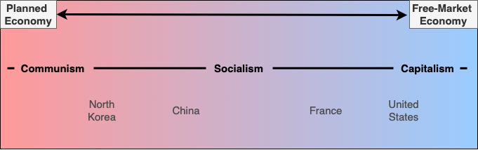

# Economic Systems

## <mark style="color:purple;">What is an Economic System?</mark>

In order to have an economic system, the people of a society must decide the following:

1. What to produce.
2. How to produce it.
3. Who gets these products.

It all comes down to who owns and controls the four factors of production, which are:

1. Land
   * This includes all natural resources used in the production process.
2. Labor
   * The human effort, both physical and intellectual, that goes into the creation of goods and services.
3. Capital
   * Refers to all man-made resources used in the production process, including machinery, buildings, tools, and technology.
4. Entrepreneurship
   * The initiative to combine land, labor, and capital to create and market new goods and services.

## <mark style="color:purple;">Economic Spectrum</mark>

### Planned Economy

* The central government controls the factors of production.
* Businesses are government-owned monopolies that inhibit any domestic competition.
* The goal is to ensure equal distribution of all goods and services to citizens.
* Pure communism is an example of a planned economy, where the abolition of private property results in a classless society.

### Free-Market Economy

* Individuals in society own the factors of production.
* The central government adopts a laissez faire (hands off) approach with regards to production, commerce, and trade.
* The government is in charge of maintaining the rule of law, regulation, and providing public goods and services.
* Pure capitalism is an example of a free-market economy, where businesses are owned by individuals in society, resulting in vast competition.
* Businesses are incentivized to produce things that people want as efficiently as possible, since the end goal for a company is to make a profit.
* Competition also incentivizes the production of high quality products at reasonable prices, otherwise consumers will not want to buy the product.

### Mixed Economy

* Most economic systems today are a mixed economies that fall somewhere between a planned economy and a free-market economy. This is because each far-end of the spectrum is impractical in a real-world, large-scale society.
* A mixed economy takes bits and pieces of various economic theories to create a system that is "optimal" for the personal values of its society.
* The logic behind mixed economies can be summed up by a quote from [Thomas Sowell](https://en.wikipedia.org/wiki/Thomas\_Sowell), "there are no solutions, only trade-offs."

<figure><figcaption>
Figure 1: Economic Spectrum
</figcaption></figure>
