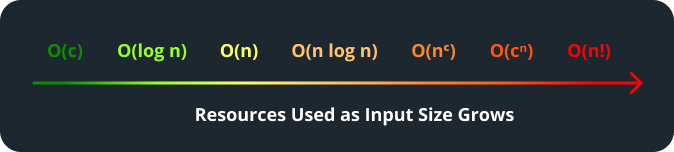

# Computational Complexity

## Introduction

When it comes to problem-solving, there are often multiple solutions for a single problem. In computer science, an algorithm represents a systematic method for processing data to solve a specific problem. To assess and compare the efficiency of different algorithms, we have two standard measures of performance: time complexity and space complexity. Together, these metrics constitute what is known as the computational complexity of an algorithm, which refers to the amount of resources required to execute the algorithm. Understanding computational complexity is crucial when it comes to identifying the "best" solution to a particular computer science problem.

Many blogs and notes that go over Big O notation online tend to focus only on time complexity. This is because time complexity generally has a more direct impact on the user experience. Algorithms that are slow can lead to noticeable delays in execution, whereas space complexity issues might not be as apparent until there are constraints on memory. Additionally, with the increasing availability of memory resources in modern computing, time efficiency tends to be a more pressing bottleneck in performance.

These notes will go over both time complexity and space complexity, in detail.

## Big O Notation

Big O notation is a type of mathematical notation used to describe how an algorithm behaves as the amount of data it needs to process becomes larger. It typically involves the symbol $$O$$ and the variable $$n$$.

The $$O$$ represents the order of complexity, indicating the asymptotic upper bound, or worst case scenario of an algorithm's growth rate. This means the resource usage won't exceed the growth rate specified by the function describing its behavior.

The $$n$$ denotes the size of the input data to the algorithm.

The table below uses Big O notation to succinctly break down seven common complexities and their impact on resource usage with increasing input size.

<table><thead><tr><th width="136">Complexity</th><th width="129">Behavior</th><th>Description</th></tr></thead><tbody><tr><td>O(n!)</td><td>Factorial</td><td>The use of resources increases drastically with each additional input element.</td></tr><tr><td>O(c^n)</td><td>Exponential</td><td>The use of resources multiplies by c with each additional input element, where c can be any positive real number.</td></tr><tr><td>O(n^c)</td><td>Polynomial</td><td>The use of resources increases in proportion to the input size raised to the power of c, where c can be any positive real number.</td></tr><tr><td>O(n\;log\;n)</td><td>Linearithmic</td><td>The use of resources increases slightly faster than linearly with each additional input element.</td></tr><tr><td>O(n)</td><td>Linear</td><td>The use of resources grows in direct proportion to the input size.</td></tr><tr><td>O(log\;n)</td><td>Logarithmic</td><td>The use of resources increases logarithmically with each additional input element.  This means the rate of increase slows as the input size grows.</td></tr><tr><td>O(c )</td><td>Constant</td><td>The use of resources is the same for any input size.</td></tr></tbody></table>

Figure 1 below illustrates the behavior of each complexity as input size grows. Note that the y-axis includes two types of resources. This is because Big O notation can be used to describe either time complexity or space complexity. The only difference is that time complexity is measured in terms of CPU operations as a function of input size, and space complexity is measured in terms of memory space required, also as a function of input size.

<figure><figcaption>
Figure 1: Complexity Functions Graph
</figcaption></figure>

Another way to visualize how the amount of resources used increases with input size is with a resource usage line, as shown in Figure 2.

<figure><figcaption>
Figure 2: Complexity Functions Visualized as a Resource Usage Line
</figcaption></figure>

## Time Complexity

Coming soon...

## Space Complexity

Coming soon...
