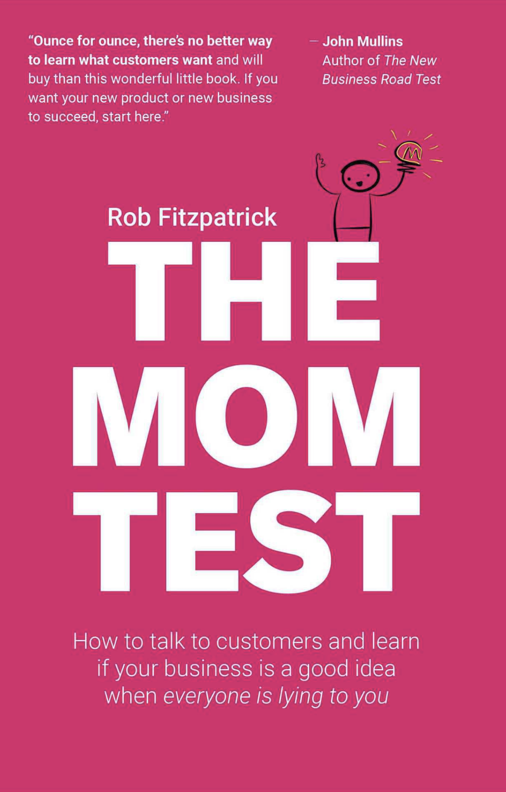

# Talking to Users

## The Mom Test

It's common to hear that you shouldn't ask your mom for feedback on your business idea, because she loves you and will lie to you. More specifically, you shouldn't ask her (or anyone) whether your idea is a good. This is because this is the wrong question to ask.

As a founder, it is your responsibility to seek the truth about your business idea by asking the right questions.

The Mom Test is a set of three simple rules for crafting good questions that even your mom can't lie to you about.

1. Talk about their life instead of your idea.
2. Ask about specifics in the past instead of generics or opinions about the future.
3. Talk less and listen more.

 [The Mom Test by Rob Fitzpatrick](https://www.amazon.com/Mom-Test-customers-business-everyone/dp/1492180742/ref=tmm\_pap\_swatch\_0?\_encoding=UTF8\&qid=1661921988\&sr=8-1)

## Info Needed from Users

Talking to users (or potential users) does not need to follow a strict format, but the following five questions should get answered, in some way, by the end of the conversation.

1. What is the hardest part about doing the thing that you're trying to solve?
2. Tell me about the last time you encountered this problem.
3. Why was this hard?
4. What, if anything, have you done to try to solve this problem?
5. What don't you love about the solutions that you've already tried?
